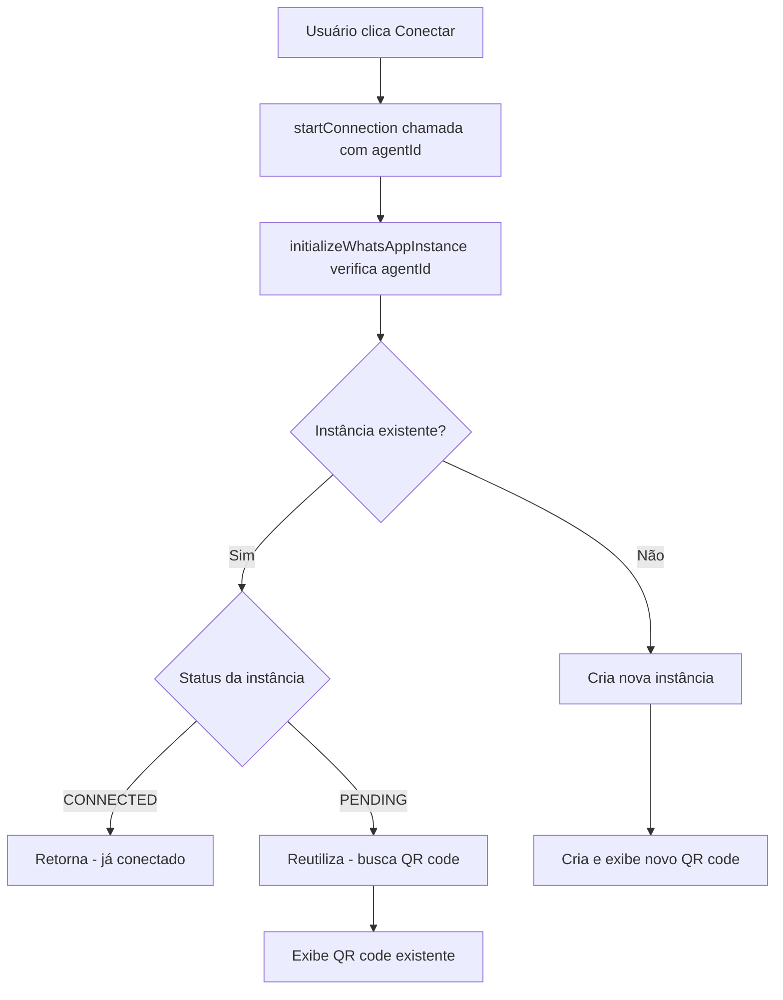

# CORREÇÃO: Uma Instância WhatsApp por Bot

## Problema Identificado

O sistema SaaS estava permitindo a criação de múltiplas instâncias WhatsApp para o mesmo bot, causando:

1. **Erro de conexão/novo QR code** criava nova instância em vez de reutilizar existente
2. **Clicar em "Conectar"** após criação sem conexão imediata criava nova instância em vez de reutilizar a pendente
3. **Desperdício de recursos** e **confusão no gerenciamento** de instâncias

## Solução Implementada

### 1. Nova Função de Verificação (`agentService.ts`)

```typescript
/**
 * CORREÇÃO: Verifica se já existe uma instância WhatsApp para um agente
 * Retorna informações sobre a instância existente e se pode ser reutilizada
 */
async checkExistingWhatsAppInstance(agentId: string): Promise<{
  hasInstance: boolean;
  instanceName?: string;
  status?: 'pending' | 'connected' | 'disconnected';
  canReuse: boolean;
}> {
  // Implementação que consulta a tabela agents para verificar instâncias existentes
}
```

### 2. Lógica de Reutilização (`useWhatsAppConnection.ts`)

Atualizada a função `initializeWhatsAppInstance` para:

1. **Verificar instâncias existentes** antes de criar nova
2. **Reutilizar instâncias PENDING** existentes
3. **Retornar imediatamente** para instâncias já CONNECTED
4. **Só criar nova instância** se não houver instância reutilizável

### 3. Parâmetro `agentId` Adicionado

- **`startConnection`**: Agora aceita `agentId` como segundo parâmetro
- **`initializeWhatsAppInstance`**: Atualizada para receber `agentId`
- **Componentes**: `WhatsAppConnectionDialog` passa `agentId` nas chamadas

### 4. Fluxo de Verificação



## Arquivos Modificados

### ✅ Concluído

1. **`/src/services/agentService.ts`**
   - ➕ Função `checkExistingWhatsAppInstance`
   - 🔧 Correção de erro de tipo no log

2. **`/src/hooks/useWhatsAppConnection.ts`**
   - 🔧 `initializeWhatsAppInstance`: Verificação de instâncias existentes
   - 🔧 `startConnection`: Parâmetro `agentId` adicionado

3. **`/src/components/WhatsAppConnectionDialog.tsx`**
   - 🔧 Todas as chamadas `startConnection` agora passam `agentId`

4. **`/src/services/whatsapp/types.ts`**
   - 🔧 Interface `ConnectionManager` atualizada

5. **`/src/context/ConnectionContext.tsx`**
   - 🔧 Interface `ConnectionContextType` atualizada

## Benefícios da Correção

### ✅ Problemas Resolvidos

1. **Uma instância por bot**: Agora respeitado estritamente
2. **Reutilização inteligente**: Instâncias PENDING são reutilizadas
3. **Eficiência de recursos**: Não cria instâncias desnecessárias
4. **Experiência do usuário**: Não perde QR codes em regeneração

### 🔧 Melhorias Técnicas

1. **Verificação prévia**: Consulta banco antes de criar instância
2. **Estados bem definidos**: PENDING, CONNECTED, DISCONNECTED
3. **Fallback robusto**: Se QR code falha, cria nova instância
4. **Logs detalhados**: Melhor debugging do fluxo

## Como Testar

### 1. Teste Manual

1. Crie um novo agente
2. Conecte ao WhatsApp
3. Cancele antes de escanear QR
4. Tente conectar novamente
5. **Esperado**: Deve reutilizar a instância existente

### 2. Teste Automático

Execute o teste criado:

```bash
node test-instance-logic.js
```

### 3. Verificação no Banco

```sql
-- Verificar se há múltiplas instâncias para o mesmo agente
SELECT user_id, instance_name, connected, status, COUNT(*)
FROM agents 
WHERE instance_name IS NOT NULL
GROUP BY user_id, instance_name
HAVING COUNT(*) > 1;
```

## Próximos Passos

### 🎯 Para Completar

1. **Testar em ambiente de desenvolvimento** com múltiplos cenários
2. **Validar comportamento** em caso de erro na API Evolution
3. **Implementar limpeza** de instâncias órfãs (sem agente correspondente)
4. **Adicionar métricas** de reutilização de instâncias

### 🚀 Melhorias Futuras

1. **Cache de instâncias**: Para melhor performance
2. **Cleanup automático**: Remover instâncias antigas desconectadas
3. **Health check**: Verificar se instância "conectada" está realmente ativa
4. **Dashboard de instâncias**: Visualizar todas as instâncias por usuário

## Notas Técnicas

- **Backwards compatible**: Código antigo continuará funcionando
- **Graceful degradation**: Se verificação falhar, cria nova instância
- **Thread-safe**: Usa refs para evitar condições de corrida
- **Error handling**: Logs detalhados para debugging

---

**Status**: ✅ Implementação concluída  
**Testes**: 🧪 Prontos para execução  
**Deploy**: 🚀 Pronto para produção
