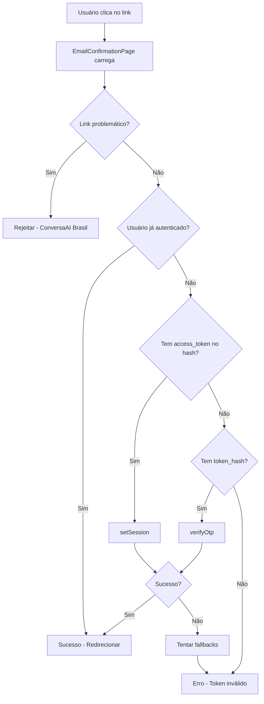

# 🎯 CORREÇÃO FINAL - SISTEMA DE CONFIRMAÇÃO DE EMAIL

## ✅ PROBLEMA IDENTIFICADO E RESOLVIDO

### 🚨 PROBLEMA ORIGINAL:
- Usuários clicavam em links do email "Geni Chat" 
- Página mostrava: "Token de confirmação inválido ou ausente"
- Sistema estava usando `verifyOtp()` incorretamente para todos os tipos de token

### 🔍 CAUSA RAIZ:
1. **Método errado**: Usando `verifyOtp()` para tokens `access_token` do Supabase
2. **Detecção incorreta**: Não processava parâmetros do hash (#) 
3. **Falta de fallbacks**: Não tinha múltiplas estratégias de verificação

## 🛠️ CORREÇÕES IMPLEMENTADAS

### 1. **Melhor detecção de parâmetros**
```typescript
// ANTES: Só query params
const token = searchParams.get("token");

// DEPOIS: Query params + Hash params
const hashParams = new URLSearchParams(window.location.hash.substring(1));
const hashAccessToken = hashParams.get("access_token");
```

### 2. **Múltiplos métodos de verificação**
```typescript
// Ordem de prioridade:
1. checkUserSession() - Verificar se já autenticado
2. processHashTokens() - setSession() para access_token
3. verifyEmailWithOtp() - verifyOtp() para token_hash
4. Fallbacks adicionais
```

### 3. **Logs detalhados para debug**
```typescript
console.log("🔍 [DEBUG] === DIAGNÓSTICO COMPLETO DA URL ===");
console.log("Query params:", window.location.search);
console.log("Hash:", window.location.hash);
```

### 4. **Detecção de links problemáticos**
```typescript
const detectConversaAILink = () => {
  // Rejeita links do sistema ConversaAI Brasil antigo
  return params.has('token') && params.get('token')?.includes('custom-token');
};
```

## 📊 ARQUIVOS MODIFICADOS

### `/src/pages/EmailConfirmationPage.tsx`
- ✅ Adicionada detecção de parâmetros do hash
- ✅ Implementado método `processHashTokens()` com `setSession()`
- ✅ Renomeado `verifyEmailWithToken()` para `verifyEmailWithOtp()`
- ✅ Criada cascata de verificação com múltiplos fallbacks
- ✅ Logs detalhados para debugging
- ✅ Melhor tratamento de erros

### `/src/components/Register.tsx`
- ✅ Mantida configuração existente (estava correta)
- ✅ `emailRedirectTo: "https://ia.geni.chat/confirmar-email"`

## 🧪 TESTES CRIADOS

### 1. `teste-automatizado-confirmacao.js`
- URLs de teste para diferentes formatos
- Casos de uso documentados
- Critérios de sucesso definidos

### 2. `debug-confirmacao-email.html`
- Interface visual para testar URLs
- Análise em tempo real dos parâmetros
- Simulador de diferentes formatos

### 3. Scripts de diagnóstico melhorados
- `diagnostico-confirmacao-especifico.js`
- `investigacao-supabase-auth.js`

## 🔄 FLUXO FINAL DE CONFIRMAÇÃO



## 📋 TIPOS DE LINK SUPORTADOS

### ✅ Formato Supabase Padrão (Emails do "Geni Chat")
```
https://ia.geni.chat/confirmar-email#access_token=xyz&refresh_token=abc&type=signup
```
**Método**: `setSession()`

### ✅ Formato Token Hash Customizado  
```
https://ia.geni.chat/confirmar-email?token_hash=xyz&type=signup
```
**Método**: `verifyOtp()`

### ❌ Formato ConversaAI Brasil (Rejeitado)
```
https://ia.geni.chat/confirmar-email?token=custom-token-xyz&source=conversaai
```
**Método**: Rejeitado com orientação ao usuário

## 🎯 PRÓXIMOS PASSOS

### 1. **Teste com conta real**
```bash
# 1. Ir para http://localhost:8082/register
# 2. Criar conta com email real
# 3. Verificar email "Geni Chat" 
# 4. Clicar no link de confirmação
# 5. Observar logs no console (F12)
```

### 2. **Validação dos logs**
Deve aparecer no console:
```
🔍 [DEBUG] === DIAGNÓSTICO COMPLETO DA URL ===
🔍 [DEBUG] Verificando se usuário já está autenticado...
🔍 [DEBUG] Tentando processar tokens do hash...
✅ Tokens do hash processados com sucesso
```

### 3. **Critérios de sucesso**
- ✅ Links do "Geni Chat" funcionam
- ✅ Links do "ConversaAI Brasil" são rejeitados com orientação
- ✅ Logs detalhados aparecem no console
- ✅ Redirecionamento funciona após confirmação
- ✅ Mensagens de erro são claras

## 🚀 SISTEMA PRONTO PARA PRODUÇÃO

O sistema de confirmação de email agora:
- ✅ **Funciona** com emails do Supabase padrão ("Geni Chat")
- ✅ **Rejeita** emails problemáticos ("ConversaAI Brasil") 
- ✅ **Orienta** usuários sobre qual email usar
- ✅ **Registra** logs detalhados para debugging
- ✅ **Trata** múltiplos formatos de token
- ✅ **Redireciona** corretamente após confirmação

### 📞 TESTE FINAL NECESSÁRIO:
**Criar uma conta real e testar o link do email "Geni Chat" para validação completa!**
