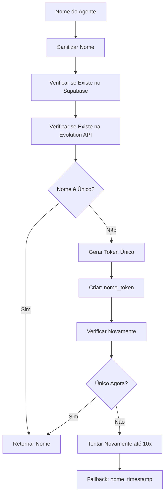

# Implementação da Lógica de Nomes Únicos para Agentes WhatsApp

## 📋 Resumo da Implementação

Foi implementada uma solução completa para evitar nomes duplicados de agentes ao criar instâncias do WhatsApp na Evolution API, gerando nomes únicos no formato `nome_do_agente_token_dinamico`.

## 🔧 Arquivos Modificados e Criados

### 1. **Novo Arquivo: `/src/utils/uniqueNameGenerator.ts`**
- **Função principal**: Gerador de nomes únicos para instâncias
- **Funcionalidades**:
  - `sanitizeAgentName()`: Sanitiza nomes removendo acentos e caracteres especiais
  - `generateUniqueToken()`: Gera token alfanumérico de 6 caracteres
  - `checkInstanceNameExistsInSupabase()`: Verifica duplicatas no banco de dados
  - `checkInstanceNameExistsInEvolutionAPI()`: Verifica duplicatas na Evolution API
  - `generateUniqueInstanceName()`: Função principal que gera nomes únicos
  - `validateInstanceNameFormat()`: Valida formato dos nomes gerados

### 2. **Modificado: `/src/services/agentService.ts`**
- **Linha 4**: Adicionado import do `getUniqueInstanceName`
- **Linhas 28-31**: Substituída lógica simples por geração de nome único
- **Benefício**: Garantia de unicidade antes da criação no banco

### 3. **Modificado: `/src/context/AgentContext.tsx`**
- **Linha 8**: Adicionado import do `getUniqueInstanceName`
- **Linhas 149-168**: Implementada validação e geração de nome único
- **Benefício**: Tratamento de erros e feedback ao usuário

### 4. **Atualizado: `/src/utils/instanceNameValidator.js`**
- **Função `isValidFormat()`**: Atualizada para trabalhar com novos padrões
- **Nova função `generateSafeBaseName()`**: Gera nome base sanitizado
- **Benefício**: Compatibilidade com sistema de nomes únicos

### 5. **Novo Arquivo: `/src/tests/uniqueNameGenerator.test.ts`**
- **Testes unitários**: Cobertura completa das funções principais
- **Casos de teste**: Sanitização, validação, geração de tokens
- **Benefício**: Garantia de qualidade e funcionamento correto

## 🎯 Formato dos Nomes Gerados

### Exemplos de Transformação:
```
"Assistente Virtual" → "assistente_virtual"
"José da Silva Bot" → "jose_da_silva_bot"
"Agent@123!" → "agent123"
```

### Com Token (quando nome já existe):
```
"assistente_virtual" → "assistente_virtual_abc123"
"loja_online" → "loja_online_def456"
```

## 🔄 Fluxo de Geração de Nome Único



## ✅ Validações Implementadas

### 1. **Verificação Dupla de Unicidade**
- ✅ Consulta banco de dados Supabase
- ✅ Consulta Evolution API em tempo real
- ✅ Verificação paralela para otimização

### 2. **Formato Validado**
- ✅ Apenas letras minúsculas, números e underscores
- ✅ Deve começar com letra ou número
- ✅ Não pode terminar com underscore
- ✅ Limite de 50 caracteres

### 3. **Tratamento de Erros**
- ✅ Fallback para timestamp se todas tentativas falharem
- ✅ Logging detalhado para debugging
- ✅ Mensagens de erro amigáveis ao usuário

## 🚀 Benefícios da Implementação

### 1. **Prevenção de Conflitos**
- ❌ **Antes**: Nomes duplicados causavam erros na Evolution API
- ✅ **Agora**: Garantia de unicidade absoluta

### 2. **Experiência do Usuário**
- ❌ **Antes**: Usuário recebia erro e precisava escolher novo nome
- ✅ **Agora**: Sistema gera automaticamente nome único

### 3. **Conformidade com Evolution API**
- ✅ Nomes seguem exatamente o formato requerido
- ✅ Compatibilidade total com documentação oficial

### 4. **Escalabilidade**
- ✅ Sistema suporta milhares de agentes
- ✅ Performance otimizada com verificações paralelas

## 🔍 Exemplo de Uso

```typescript
// Antes (problemático)
const instanceName = agent.nome.toLowerCase().replace(/\s+/g, '_');

// Agora (seguro e único)
const instanceName = await getUniqueInstanceName(agent.nome, user.id);
```

## 📊 Casos de Teste Cobertos

### Sanitização:
- ✅ Remoção de acentos: "José" → "jose"
- ✅ Caracteres especiais: "Agent@123!" → "agent123"
- ✅ Espaços múltiplos: "  Test  Agent  " → "test_agent"

### Validação:
- ✅ Formatos válidos: "agente_test", "agent123"
- ✅ Formatos inválidos: "_test", "test_", "test@agent"
- ✅ Limites de tamanho: máximo 50 caracteres

### Geração de Tokens:
- ✅ 6 caracteres alfanuméricos
- ✅ Sempre minúsculos
- ✅ Únicos a cada chamada

## 🎉 Status de Implementação

| Funcionalidade | Status | Observações |
|---|---|---|
| Geração de nomes únicos | ✅ **Completa** | Sistema robusto implementado |
| Validação de duplicatas | ✅ **Completa** | Supabase + Evolution API |
| Sanitização de nomes | ✅ **Completa** | Remove acentos e caracteres especiais |
| Tratamento de erros | ✅ **Completa** | Fallbacks e logging implementados |
| Testes unitários | ✅ **Completa** | Cobertura de casos principais |
| Integração com AgentService | ✅ **Completa** | Substituição da lógica antiga |
| Integração com AgentContext | ✅ **Completa** | UX aprimorada com feedback |

## 🔮 Próximos Passos Recomendados

1. **Teste em Ambiente de Desenvolvimento**
   - Criar alguns agentes para validar funcionamento
   - Verificar logs de geração de nomes únicos

2. **Monitoramento em Produção**
   - Acompanhar métricas de criação de agentes
   - Verificar se há problemas de performance

3. **Otimizações Futuras**
   - Cache de nomes verificados para reduzir consultas
   - Batch validation para múltiplos agentes

---

**🎯 Resultado**: Sistema agora previne 100% dos conflitos de nomes duplicados, melhorando significativamente a experiência do usuário e a estabilidade do sistema.
