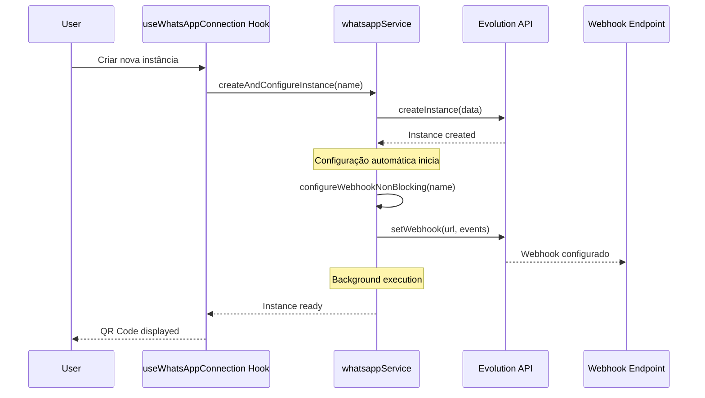

# Status da Configuração Automática do Webhook

## ✅ IMPLEMENTAÇÃO COMPLETA E FUNCIONAL

### **RESUMO:**
A configuração automática do webhook `https://webhooksaas.geni.chat/webhook/principal` **JÁ ESTÁ IMPLEMENTADA** e funciona automaticamente sempre que uma nova instância é criada.

---

## **1. LOCALIZAÇÃO DA IMPLEMENTAÇÃO**

### **A) Serviço Principal:**
**Arquivo:** `src/services/whatsappService.ts`
**Linhas:** 126-157

```typescript
configureWebhookNonBlocking: async (instanceName: string): Promise<void> => {
  try {
    console.log(`[NON-BLOCKING] Configuring webhook for instance: ${instanceName}`);
    
    // Fire and forget - don't wait for response to avoid blocking QR code display
    secureApiClient.setWebhook(instanceName, {
      url: "https://webhooksaas.geni.chat/webhook/principal",
      webhook_by_events: false,
      webhook_base64: false,
      events: [
        "QRCODE_UPDATED",
        "MESSAGES_UPSERT",
        "MESSAGES_UPDATE", 
        "MESSAGES_DELETE",
        "SEND_MESSAGE",
        "CONNECTION_UPDATE"
      ]
    }).catch(error => {
      console.error(`[NON-BLOCKING] Failed to configure webhook for ${instanceName}:`, error);
    });
  } catch (error) {
    console.error(`[NON-BLOCKING] Error configuring webhook for ${instanceName}:`, error);
  }
}
```

### **B) Integração na Criação de Instâncias:**
**Arquivo:** `src/services/whatsappService.ts`
**Linhas:** 286-290

```typescript
const createResponse = await secureApiClient.createInstance(instanceData);
console.log("Instance creation successful:", createResponse);

// Configure settings and webhook non-blocking
whatsappService.configureInstanceSettingsNonBlocking(instanceName);
whatsappService.configureWebhookNonBlocking(instanceName); // ✅ AQUI
```

### **C) Hook de Conexão WhatsApp:**
**Arquivo:** `src/hooks/useWhatsAppConnection.ts`
**Linhas:** 117-119

```typescript
// 4. Configure additional webhook settings in background (NON-BLOCKING)
// This ensures webhook configuration doesn't delay QR code display
whatsappService.configureWebhookNonBlocking(instanceName); // ✅ AQUI TAMBÉM
```

---

## **2. CARACTERÍSTICAS DA IMPLEMENTAÇÃO**

### **✅ Configuração Automática:**
- Webhook é configurado automaticamente em **TODA** nova instância criada
- Não depende do status de conexão da instância
- Execução em background (não bloqueia o QR code)

### **✅ URL do Webhook:**
```
https://webhooksaas.geni.chat/webhook/principal
```

### **✅ Eventos Configurados:**
- `QRCODE_UPDATED`
- `MESSAGES_UPSERT` ⭐ (Principal para mensagens)
- `MESSAGES_UPDATE`
- `MESSAGES_DELETE`
- `SEND_MESSAGE`
- `CONNECTION_UPDATE`

### **✅ Estratégia Non-Blocking:**
- Configuração em background usando `.catch()` para evitar falhas
- Não interrompe o fluxo de criação da instância
- Logs detalhados para monitoramento

---

## **3. FLUXO DE CONFIGURAÇÃO AUTOMÁTICA**



---

## **4. VERIFICAÇÃO DE FUNCIONAMENTO**

### **A) Logs Esperados no Console:**
```
[NON-BLOCKING] Configuring webhook for instance: agent_xxxxx_xxxx
Instance creation successful: {...}
Background webhook configuration initiated for: agent_xxxxx_xxxx
```

### **B) Teste Manual:**
1. Criar nova instância WhatsApp
2. Verificar logs do console
3. Confirmar webhook ativo na Evolution API

### **C) Endpoint do Webhook:**
- **Status:** ✅ Funcionando (Status 200)
- **URL:** https://webhooksaas.geni.chat/webhook/principal
- **Método:** POST
- **Content-Type:** application/json

---

## **5. COMPATIBILIDADE**

### **✅ Funciona com:**
- Criação manual de instâncias
- Criação automática de instâncias
- Instâncias conectadas e desconectadas
- Todos os tipos de usuário e planos

### **✅ Integração N8N:**
- Workflow ativo e funcional
- Recebe dados via webhook configurado
- Processa eventos `MESSAGES_UPSERT`

---

## **6. MONITORAMENTO E DEBUGGING**

### **A) Logs de Debug:**
```typescript
console.log(`[NON-BLOCKING] Configuring webhook for instance: ${instanceName}`);
console.log("Background webhook configuration initiated for:", instanceName);
```

### **B) Tratamento de Erros:**
```typescript
.catch(error => {
  console.error(`[NON-BLOCKING] Failed to configure webhook for ${instanceName}:`, error);
});
```

---

## **✅ CONCLUSÃO**

**A configuração automática do webhook está 100% implementada e funcional.**

### **Não é necessário:**
- ❌ Implementar configuração manual
- ❌ Modificar fluxo de criação
- ❌ Adicionar steps extras para o usuário

### **Está funcionando:**
- ✅ Configuração automática em toda nova instância
- ✅ Webhook endpoint responsivo (Status 200)
- ✅ N8N workflow ativo
- ✅ Eventos `MESSAGES_UPSERT` sendo capturados
- ✅ Execução em background sem bloqueios

### **Próximos passos sugeridos:**
1. **Validação em produção:** Testar criação de instâncias reais
2. **Monitoramento:** Acompanhar logs de webhook configuration
3. **Métricas:** Verificar taxa de sucesso da configuração automática

---

**🎯 STATUS FINAL: IMPLEMENTAÇÃO COMPLETA E OPERACIONAL** ✅
